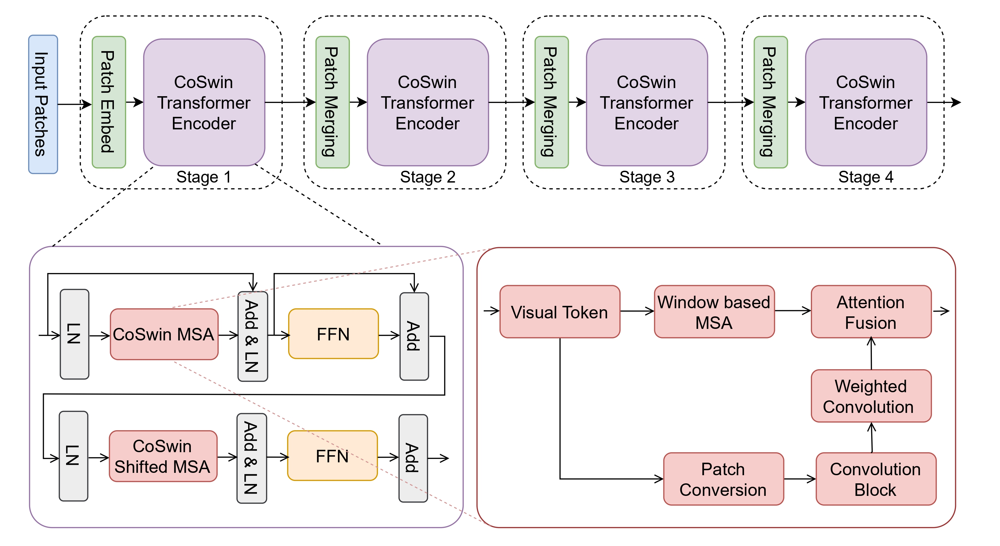
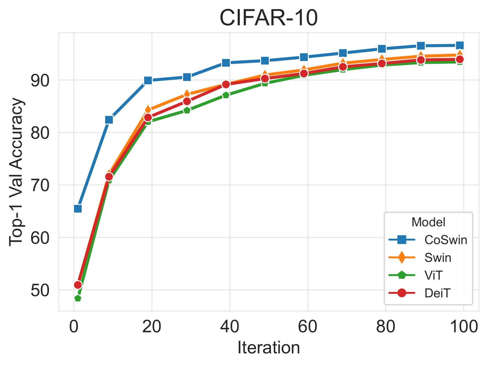
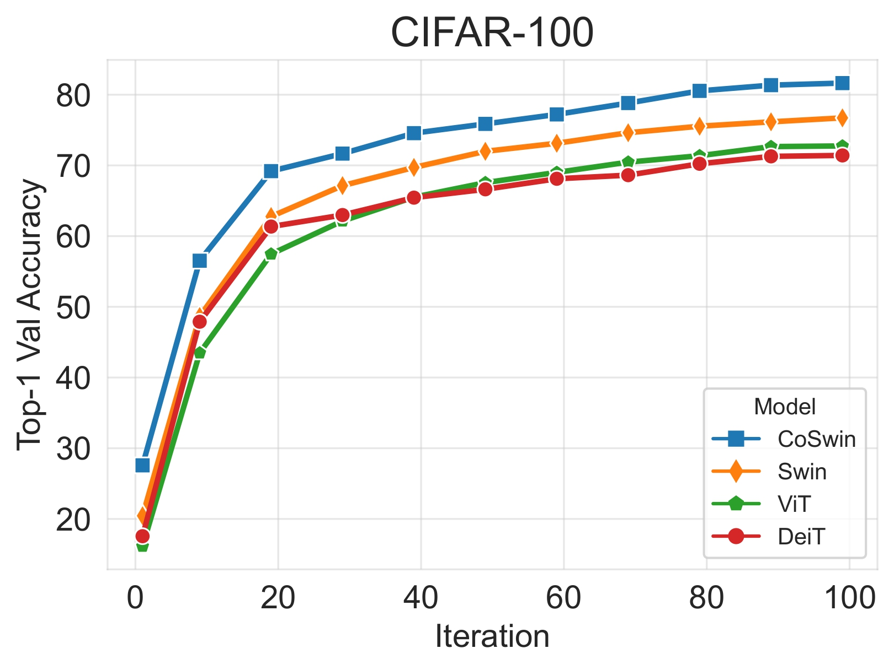
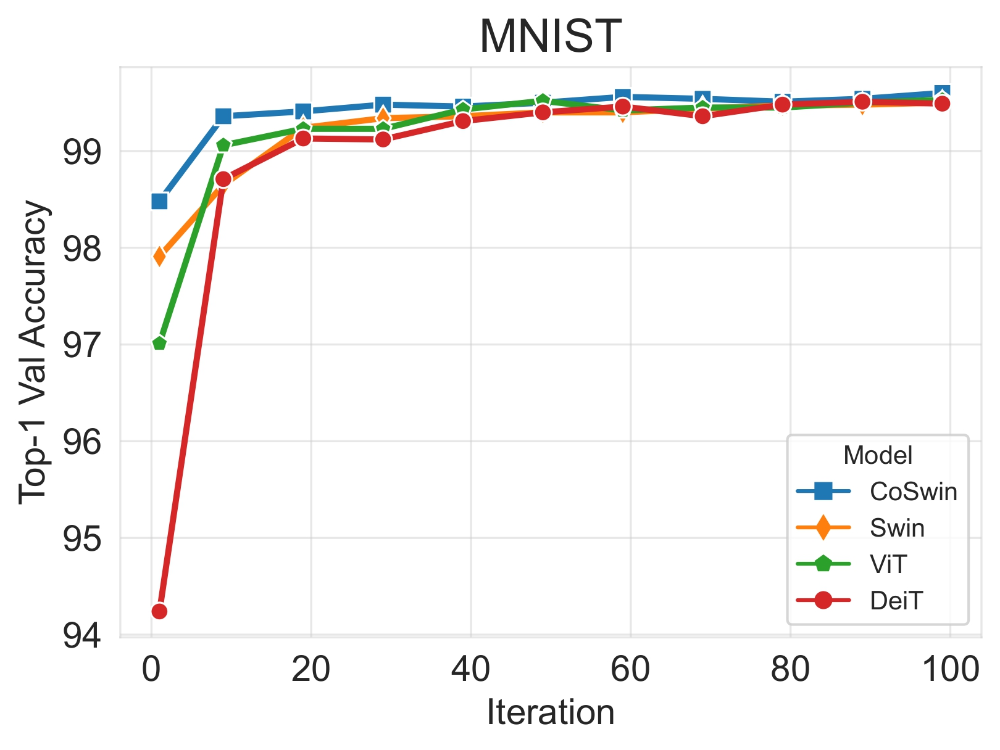
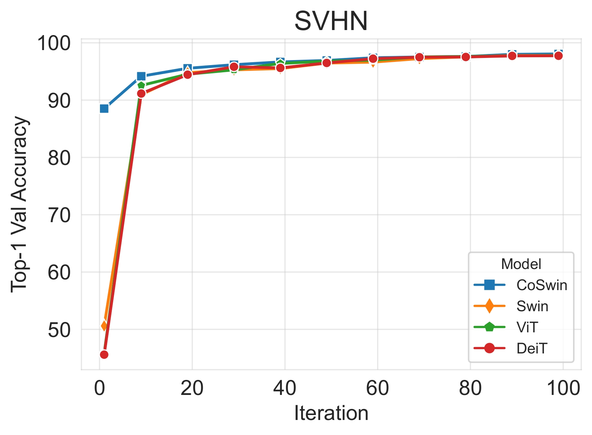

$\color{gray}{Anonymous\ Researchers | Submitted\ to\ BMVC\ 2025}$

 #### CoSwin: Convolution Enhanced Hierarchical Shifted Window Attention For Small-Scale Vision

<p> We propose CoSwin, a novel feature-fusion architecture that augments the hierarchical shifted window attention with localized feature learning. </p>
<p align="center">

</p>


##  Note
- We have released the source code and model weights.

## Training
To train the CoSwin model on different benchmark datasets:
```
python train.py --model coswin --dataset TINY-IMAGENET 
```
To perform Grad-CAM visualization: 
<p>Make sure to place the images you want to visualize in a separate directory. </p>

```
python gradcam.py --model coswin --dataset TINY-IMAGENET --model_path /path/to/your/model  
```

## Model Weights
<table style="text-align: center;" >
  <tr>
    <th rowspan="6" style="text-align: center;">CoSwin</th>
    <th>Dataset</th>
    <th>Training Size</th>
    <th>Accuracy@1</th>
    <th>Size</th>
    <th>Model Weight</th>
  </tr>
  <tr >
    <td>CIFAR-10</td>
    <td>50,000</td>
    <td>96.63</td>
    <td>32x32</td>
    <td><a href="https://github.com/anynomous-user/coswin/releases/download/v1.0.0/checkpoint_coswin_CIFAR10.pt">Download</a></td>
  </tr>
  <tr>
    <td>CIFAR-100</td>
    <td>50,000</td>
    <td>81.64</td>
    <td>32x32</td>
    <td><a href="https://github.com/anynomous-user/coswin/releases/download/v1.0.0/checkpoint_coswin_CIFAR100.pt">Download</a></td>
  </tr>
  <tr>
    <td>MNIST</td>
    <td>60,000</td>
    <td>99.60</td>
    <td>28x28</td>
    <td><a href="https://github.com/anynomous-user/coswin/releases/download/v1.0.0/checkpoint_coswin_MNIST.pt">Download</a></td>
  </tr>
  <tr>
    <td>SVHN</td>
    <td>73,257</td>
    <td>98.07</td>
    <td>32x32</td>
    <td><a href="https://github.com/anynomous-user/coswin/releases/download/v1.0.0/checkpoint_coswin_SVHN.pt">Download</a></td>
  </tr>
   <tr>
    <td>TINY IMAGENET</td>
    <td>100,000</td> 
    <td>65.06</td>
    <td>64x64</td>
    <td><a href="https://github.com/anynomous-user/coswin/releases/download/v1.0.0/checkpoint_coswin_TINY-IMAGENET.pt">Download</a></td>
  </tr>
</table>

## Results

CoSwin demonstrates strong performance on small dataset challenges compared to existing state-of-the-art models. 

<div style="display: flex; justify-content: space-between; gap: 2px;">
  
  
  
  
  
